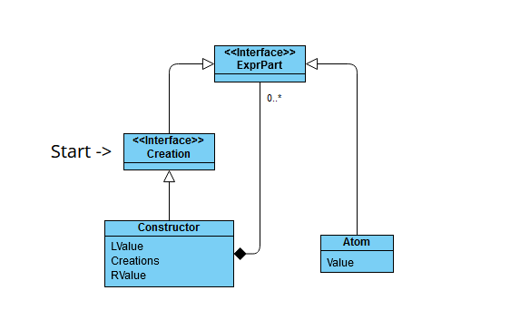

# Sprachkonzepte Übung WS24/25

Stefan Ptacek und Patrick Zedler

Bericht über die Bearbeitung der Aufgaben.

## Aufgabe 1

### Aufgabenstellung

Sie sollen das Vokabular eines Textes mit ANTLR4 Lexer-Regeln beschreiben und eine Anwendung erstellen, die einen entsprechenden Text einliest und als Tokenfolge wieder ausgibt (siehe ExprTokenizer.java aus der Vorlesung).

Zwei Texte stehen zur Auswahl (natürlich dürfen Sie auch beide bearbeiten): Informationen aus der Abfahrtstafel Konstanz der Deutschen Bahn in abfahrten-kn.txt oder Angaben zu den Öffnungszeiten der Mainau-Gastronomie in mainau-gastronomie.txt. Die beiden Texte finden Sie auf der Moodle-Seite.

Den Text abfahrten-kn.txt habe ich aus der Webseite https://www.bahn.de/buchung/abfahrten-ankuenfte für den Bahnhof Konstanz extrahiert. Sie können gerne weitere Abfahrten ergänzen.

Den Text mainau-gastronomie.txt habe ich aus der Webseite https://www.mainau.de/de/oeffnungszeiten extrahiert. Sie können sich gerne weitere gastronomische Angebote ausdenken.

Welche Vokabular-Kategorien von Folie 2-4 kommen im Text vor? Bedenken Sie dazu, dass ja nicht nur der eine vorgegebene Text erfolgreich zerlegt werden soll, sondern auch andere Beispieltexte der gleichen Art.

### Lösung Code

TokenPrinter.java:

```
import org.antlr.v4.runtime.CharStream;
import org.antlr.v4.runtime.CharStreams;
import org.antlr.v4.runtime.Token;
import org.antlr.v4.runtime.TokenStream;
import org.antlr.v4.runtime.CommonTokenStream;

import java.io.IOException;

public class TokenPrinter {
    public static void main(String[] args) {
        try {
            // Lese den Text von der Konsole oder aus einer Datei
            CharStream input = CharStreams.fromFileName("mainau-gatronomie.txt");

            // Erstelle eine Instanz des Lexers mit dem Eingabetext
            OpeningTimesLexer lexer = new OpeningTimesLexer(input);

            // Erstelle einen TokenStream, um die Token zu verarbeiten
            TokenStream tokens = new CommonTokenStream(lexer);

            // Schleife durch die Token und gib sie aus
            Token token;
            while ((token = lexer.nextToken()).getType() != Token.EOF) {
                String tokenType = lexer.getVocabulary().getSymbolicName(token.getType());
                String tokenText = token.getText();
                System.out.println("Token Type: " + tokenType + ", Token Text: " + tokenText);
            }
        } catch (IOException e) {
            e.printStackTrace();
        }
    }
}
```

OpeningTimesLexer.g4:

```
lexer grammar OpeningTimesLexer;

WHITESPACE : [ \t\r\n]+ -> skip ;

KW_BIS : 'bis' ;
KW_TAEGLICH : 'täglich' ;
KW_RUHETAG : 'Ruhetag' ;
KW_AN : 'an' ;
KW_FREITAG : 'Freitag' ;
KW_MONTAG : 'Montag' ;
KW_DIENSTAG : 'Dienstag' ;
KW_MITTWOCH : 'Mittwoch' ;
KW_DONNERSTAG : 'Donnerstag' ;
KW_SAMSTAG : 'Samstag' ;
KW_SONNTAG : 'Sonntag' ;
KW_VORUEBERGEHEND : 'vorübergehend' ;
KW_GESCHLOSSEN : 'geschlossen' ;
KW_BEI : 'bei' ;
KW_GUTEM_WETTER : 'gutem Wetter' ;
KW_UHR : 'Uhr' ;

NUMBER : [0-9]+ ;
DATE : NUMBER '. ' [A-Z\u00E4\u00F6\u00FC\u00C4\u00D6\u00DC\u00DF][a-z\u00E4\u00F6\u00FC\u00C4\u00D6\u00DC\u00DF]+ ;
TIME : NUMBER '.' NUMBER ' Uhr'? ;
ID : [a-zA-Z\u00E4\u00F6\u00FC\u00C4\u00D6\u00DC\u00DF\u00E9]+ ;
DOT : '.' ;
COMMA : ',' ;
MINUS : '-' ;
COLON : ':' ;
```

### Erklärung

In dieser Aufgabe haben wir einen Lexer für die mainau-gastronomie mithilfe von ANTLR4 erstellt, um die Öffnungszeiten von Restaurants aus einem Text in einzelne Token zu zerlegen. Zuerst haben wir eine Grammatikdatei (.g4) geschrieben, die festlegt, wie verschiedene Textbestandteile wie Schlüsselwörter, Datumsangaben, Uhrzeiten und Trennzeichen erkannt werden. Die Grammatik beschreibt die Regeln, um Bezeichner, Literale und Operatoren zu unterscheiden. Anschließend haben wir den Lexer in Java generiert und eine Anwendung erstellt, die den Lexer verwendet, um den Text zu verarbeiten. Der Lexer liest den Text ein und zerlegt ihn in Token, die dann in einer bestimmten Reihenfolge ausgegeben werden. Jeder Teil des Textes, wie Wochentage, Zeiträume und Sonderangaben, wird dabei als spezifischer Token klassifiziert. Zum Beispiel werden Datumsangaben als Zahlenliterale erkannt, während Wörter wie „täglich“ oder „Ruhetag“ als Schlüsselwörter eingeordnet werden. Die Ausgabe der Anwendung zeigt die Tokenfolge, die den Text strukturiert darstellt. Damit haben wir erreicht, dass auch ähnliche Texte automatisch analysiert werden können. Diese Methode hilft, die Struktur und Bedeutung von Zeitplänen aus Texten zu extrahieren.

Probleme hatten wir dabei, Sonderzeichen richtig einzulesen, da diese trotz der richtigen Formatierung aller Dateien nicht korrekt eingelesen wurden und somit als Error dargestellt wurden. Die Sonderzeichen wurden bei dem Kompilieren der Grammatik-Datei nämlich nur als Warnung angegeben weshalb dieses Problem nicht sofort aufgefallen ist. Ebenso sind Leerzeichen in der Erstellung der Grammatikdatei wichtig, damit die Token korrekt ausgelesen werden.

In der Besprechung wurde uns folgendes als Empfehlung gesagt:

- Wochentage nicht als separate Tokens, stattdessen einen Token Wochentag, den man auch in der Grammatik einfacher nutzen kann
- Sonderbehandlung von Sonderzeichen sollte bei UTF-8 eigentlich nicht nötig sein
- Uhrzeit und “Uhr” separate Tokens
- NUMBER nicht rechts verwenden, stattdessen ein Fragment number nutzen und Datum in Number mit Punkt und Number ohne Punkt aufteilen
- Punkt als separater Token ist wahrscheinlich unnötig
- “bei gutem Wetter” kann auch als ein Token zusammengefasst werden

### Ausführung Befehle

java -jar ../antlr-4.13.2-complete.jar OpeningTimesLexer.g4

javac -cp ".;..\antlr-4.13.2-complete.jar;" .\TokenPrinter.java .\OpeningTimesLexer.java

java -cp ".;..\antlr-4.13.2-complete.jar;" .\TokenPrinter.java .\OpeningTimesLexer.java

### Ausgabe des Programms

``````
Token Type: ID, Token Text: Restaurant
Token Type: ID, Token Text: Schwedenschenke
Token Type: DATE, Token Text: 15. März
Token Type: KW_BIS, Token Text: bis
Token Type: DATE, Token Text: 20. Oktober
Token Type: KW_MITTWOCH, Token Text: Mittwoch
Token Type: KW_BIS, Token Text: bis
Token Type: KW_SONNTAG, Token Text: Sonntag
Token Type: TIME, Token Text: 11.00
Token Type: KW_BIS, Token Text: bis
Token Type: TIME, Token Text: 17.00 Uhr
Token Type: DATE, Token Text: 1. Mai
Token Type: KW_BIS, Token Text: bis
Token Type: DATE, Token Text: 8. September
Token Type: KW_AN, Token Text: an
Token Type: ID, Token Text: Sonn
Token Type: MINUS, Token Text: -
Token Type: ID, Token Text: und
Token Type: ID, Token Text: Feiertagen
Token Type: TIME, Token Text: 11.00
Token Type: KW_BIS, Token Text: bis
Token Type: TIME, Token Text: 20.00 Uhr
Token Type: KW_MONTAG, Token Text: Montag
Token Type: COMMA, Token Text: ,
Token Type: KW_DIENSTAG, Token Text: Dienstag
Token Type: KW_RUHETAG, Token Text: Ruhetag
Token Type: ID, Token Text: Rothaus
Token Type: ID, Token Text: Seeterrassen
Token Type: DATE, Token Text: 1. Juni
Token Type: KW_BIS, Token Text: bis
Token Type: DATE, Token Text: 8. September
Token Type: ID, Token Text: täglich
Token Type: TIME, Token Text: 9.00
Token Type: KW_BIS, Token Text: bis
Token Type: TIME, Token Text: 20.00 Uhr
Token Type: DATE, Token Text: 9. September
Token Type: KW_BIS, Token Text: bis
Token Type: DATE, Token Text: 3. November
Token Type: ID, Token Text: täglich
Token Type: TIME, Token Text: 9.00
Token Type: KW_BIS, Token Text: bis
Token Type: TIME, Token Text: 18.00 Uhr
Token Type: ID, Token Text: Würstle
Token Type: ID, Token Text: Grill
Token Type: DATE, Token Text: 1. Mai
Token Type: KW_BIS, Token Text: bis
Token Type: DATE, Token Text: 8. September
Token Type: ID, Token Text: täglich
Token Type: TIME, Token Text: 10.00
Token Type: KW_BIS, Token Text: bis
Token Type: TIME, Token Text: 17.00 Uhr
Token Type: DATE, Token Text: 9. September
Token Type: KW_BIS, Token Text: bis
Token Type: DATE, Token Text: 20. Oktober
Token Type: ID, Token Text: täglich
Token Type: TIME, Token Text: 12.00
Token Type: KW_BIS, Token Text: bis
Token Type: TIME, Token Text: 16.00 Uhr
Token Type: ID, Token Text: Mainau
Token Type: MINUS, Token Text: -
Token Type: ID, Token Text: Träff
Token Type: ID, Token Text: mit
Token Type: ID, Token Text: Hofladen
Token Type: ID, Token Text: vorübergehend
Token Type: KW_GESCHLOSSEN, Token Text: geschlossen
Token Type: ID, Token Text: Schlosscafé
Token Type: ID, Token Text: täglich
Token Type: TIME, Token Text: 11.00
Token Type: KW_BIS, Token Text: bis
Token Type: TIME, Token Text: 17.00 Uhr
Token Type: ID, Token Text: ab
Token Type: DATE, Token Text: 13. Mai
Token Type: KW_FREITAG, Token Text: Freitag
Token Type: KW_RUHETAG, Token Text: Ruhetag
Token Type: ID, Token Text: Biergarten
Token Type: ID, Token Text: am
Token Type: ID, Token Text: Hafen
Token Type: DATE, Token Text: 23. März
Token Type: KW_BIS, Token Text: bis
Token Type: DATE, Token Text: 6. Oktober
Token Type: KW_MITTWOCH, Token Text: Mittwoch
Token Type: KW_BIS, Token Text: bis
Token Type: KW_SONNTAG, Token Text: Sonntag
Token Type: TIME, Token Text: 11.00
Token Type: KW_BIS, Token Text: bis
Token Type: TIME, Token Text: 18.00 Uhr
Token Type: KW_MONTAG, Token Text: Montag
Token Type: COMMA, Token Text: ,
Token Type: KW_DIENSTAG, Token Text: Dienstag
Token Type: KW_RUHETAG, Token Text: Ruhetag
Token Type: ID, Token Text: Bäckerei
Token Type: ID, Token Text: Täglich
Token Type: ID, Token Text: Brot
Token Type: DATE, Token Text: 1. Mai
Token Type: KW_BIS, Token Text: bis
Token Type: DATE, Token Text: 6. Oktober
Token Type: KW_FREITAG, Token Text: Freitag
Token Type: KW_BIS, Token Text: bis
Token Type: KW_DIENSTAG, Token Text: Dienstag
Token Type: TIME, Token Text: 10.00
Token Type: KW_BIS, Token Text: bis
Token Type: TIME, Token Text: 17.00 Uhr
Token Type: DATE, Token Text: 7. Oktober
Token Type: KW_BIS, Token Text: bis
Token Type: DATE, Token Text: 20. Oktober
Token Type: KW_FREITAG, Token Text: Freitag
Token Type: KW_BIS, Token Text: bis
Token Type: KW_DIENSTAG, Token Text: Dienstag
Token Type: TIME, Token Text: 11.00
Token Type: KW_BIS, Token Text: bis
Token Type: TIME, Token Text: 16.00 Uhr
Token Type: KW_MITTWOCH, Token Text: Mittwoch
Token Type: COMMA, Token Text: ,
Token Type: KW_DONNERSTAG, Token Text: Donnerstag
Token Type: KW_RUHETAG, Token Text: Ruhetag
Token Type: ID, Token Text: Eisdiele
Token Type: ID, Token Text: am
Token Type: ID, Token Text: Hafen
Token Type: DATE, Token Text: 23. März
Token Type: KW_BIS, Token Text: bis
Token Type: DATE, Token Text: 6. Oktober
Token Type: TIME, Token Text: 11.00
Token Type: KW_BIS, Token Text: bis
Token Type: TIME, Token Text: 17.00 Uhr
Token Type: KW_BEI, Token Text: bei
Token Type: KW_GUTEM_WETTER, Token Text: gutem Wetter
Token Type: ID, Token Text: Imbiss
Token Type: ID, Token Text: am
Token Type: ID, Token Text: Schmetterlingshaus
Token Type: DATE, Token Text: 23. März
Token Type: KW_BIS, Token Text: bis
Token Type: DATE, Token Text: 6. Oktober
Token Type: TIME, Token Text: 11.00
Token Type: KW_BIS, Token Text: bis
Token Type: TIME, Token Text: 16.00 Uhr
Token Type: KW_BEI, Token Text: bei
Token Type: KW_GUTEM_WETTER, Token Text: gutem Wetter
Token Type: ID, Token Text: Café
Token Type: ID, Token Text: Vergissmeinnicht
Token Type: TIME, Token Text: 10.00
Token Type: KW_BIS, Token Text: bis
Token Type: TIME, Token Text: 15.30 Uhr
Token Type: KW_SONNTAG, Token Text: Sonntag
Token Type: TIME, Token Text: 10.30
Token Type: KW_BIS, Token Text: bis
Token Type: TIME, Token Text: 16.00 Uhr
Token Type: KW_SAMSTAG, Token Text: Samstag
Token Type: KW_RUHETAG, Token Text: Ruhetag
``````

## Aufgabe 2

### 2a)

### Aufgabenstellung

Denken Sie sich eine kleine Sprache aus. Definieren Sie deren Vokabular mit einer ANTLR4 lexer grammar und deren Grammatik mit einer ANTLR4 parser grammar. Erzeugen Sie für einige Beispieltexte mit Hilfe von org.antlr.v4.gui.TestRig den Ableitungsbaum (Parse Tree).

Falls Ihnen nichts Eigenes einfällt, bauen Sie eines der beiden Beispiele aus Aufgabe 1 aus.

### Lösung Code

CreationLexer.g4:

```
lexer grammar CreationLexer ;

KEYWORD : ’new ’ ;

NAME : [A-Za -z]+ ;
NUM : [0-9]+ ;

COMMA : ’,’ ;

PAR_OPEN : ’(’ ;
PAR_CLOSE : ’)’ ;

WS : [ \t\r\n]+ ;

InvalidChar: . ;
```

CreationParser.g4:

```
parser grammar CreationParser ;
options { tokenVocab = CreationLexer ; }

start : expr EOF;

expr : KEYWORD WS NAME PAR_OPEN params PAR_CLOSE ;

params : ( param ( COMMA WS? param )*)? ;

param : ( expr | NAME | NUM) ;
```

### Erklärung

Wie haben wir die aufgabe gelöst.

### 2b)

### Aufgabenstellung

Definieren Sie mit Java-Klassen die abstrakte Syntax Ihrer Sprache aus a) und schreiben Sie ein Java-Programm, das den ANTLR4 Parse Tree in einen AST überführt. Welche Terminale und Nichtterminale aus dem Ableitungsbaum werden in Ihrem AST weggelassen?

#### Welche Terminale und Nichtterminale aus dem Ableitungsbaum werden in Ihrem AST weggelassen?

Dies und das

### UML-Diagramm



### Lösung Code

```
public interface Expr {
}

public interface Creation extends Expr {
}

public class Atom implements Expr {
private final String val ;

public Atom ( String val ) {
this .val = val;
}
public String getVal () {
return val;
}
@Override
public String toString () {
return this .val;
}
}

public class Constructor implements Creation {
private final String leftVal ;
private final List <Expr > params ;
private final String rightVal ;

public Constructor ( String leftVal , List <Expr > params , StringrightVal ) {
this . leftVal = leftVal ;
this . params = params ;
this . rightVal = rightVal ;
}
public String getLeftVal () {
return leftVal ;
}
public List <Expr > getParams () {
return params ;
}
public String getRightVal () {
return rightVal ;
}
@Override
public String toString () {
return this . leftVal + this . params + this . rightVal ;
}
}
```

```
public class CreationBuilder extends CreationParserBaseListener {

private final List <Stack <Expr >> stackList = new LinkedList < >();
private int depth = -1;

public Creation build ( ParseTree tree ) {
new ParseTreeWalker (). walk (this , tree );

return ( Creation ) this . stackList .get( this . depth ).pop ();
}

@Override
public void enterExpr ( CreationParser . ExprContext ctx) {
this . stackList .add( new Stack < >());
this . depth ++;
}

@Override
public void exitExpr ( CreationParser . ExprContext ctx) {
if (ctx. getChildCount () == 6) {
var l = new StringBuilder ();
for (int i = 0; i < 4; i++) {
l. append (ctx. getChild (i). getText ());
}

var c = new Constructor (
l. toString () ,
new LinkedList <>( this . stackList .get( this . depth )),
ctx. getChild (5). getText ()
);
this . stackList .get( this . depth ). clear ();

if ( this . depth > 0)
this .depth --;
this . stackList .get( this . depth ). push (c);

}
}

@Override
public void enterParam ( CreationParser . ParamContext ctx) {
if (ctx. start . getType () == CreationParser .NUM) {

this . stackList .get( this . depth ). push ( new Atom (ctx .NUM (). getText ()));

} else if (ctx. start . getType () == CreationParser . NAME ) {

this . stackList .get( this . depth ). push ( newAtom (ctx . NAME (). getText ()));

}
}

}
```

### Erklärung

Dies und das

## Aufgabe 3

## Aufgabe 4

## Aufgabe 5

## Aufgabe 6

## Aufgabe 7