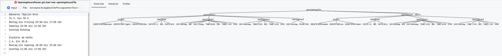
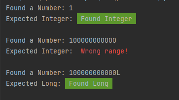
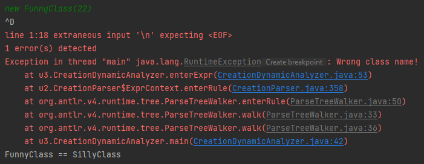

# Sprachkonzepte Übung WS24/25

Stefan Ptacek und Patrick Zedler

Bericht über die Bearbeitung der Aufgaben.

## Aufgabe 1

### Aufgabenstellung

Sie sollen das Vokabular eines Textes mit ANTLR4 Lexer-Regeln beschreiben und eine Anwendung erstellen, die einen entsprechenden Text einliest und als Tokenfolge wieder ausgibt (siehe ExprTokenizer.java aus der Vorlesung).

Zwei Texte stehen zur Auswahl (natürlich dürfen Sie auch beide bearbeiten): Informationen aus der Abfahrtstafel Konstanz der Deutschen Bahn in abfahrten-kn.txt oder Angaben zu den Öffnungszeiten der Mainau-Gastronomie in mainau-gastronomie.txt. Die beiden Texte finden Sie auf der Moodle-Seite.

Den Text abfahrten-kn.txt habe ich aus der Webseite https://www.bahn.de/buchung/abfahrten-ankuenfte für den Bahnhof Konstanz extrahiert. Sie können gerne weitere Abfahrten ergänzen.

Den Text mainau-gastronomie.txt habe ich aus der Webseite https://www.mainau.de/de/oeffnungszeiten extrahiert. Sie können sich gerne weitere gastronomische Angebote ausdenken.

Welche Vokabular-Kategorien von Folie 2-4 kommen im Text vor? Bedenken Sie dazu, dass ja nicht nur der eine vorgegebene Text erfolgreich zerlegt werden soll, sondern auch andere Beispieltexte der gleichen Art.

### Lösung Code

TokenPrinter.java:

```
import org.antlr.v4.runtime.CharStream;
import org.antlr.v4.runtime.CharStreams;
import org.antlr.v4.runtime.Token;
import org.antlr.v4.runtime.TokenStream;
import org.antlr.v4.runtime.CommonTokenStream;

import java.io.IOException;

public class TokenPrinter {
    public static void main(String[] args) {
        try {
            // Lese den Text von der Konsole oder aus einer Datei
            CharStream input = CharStreams.fromFileName("mainau-gatronomie.txt");

            // Erstelle eine Instanz des Lexers mit dem Eingabetext
            OpeningTimesLexer lexer = new OpeningTimesLexer(input);

            // Erstelle einen TokenStream, um die Token zu verarbeiten
            TokenStream tokens = new CommonTokenStream(lexer);

            // Schleife durch die Token und gib sie aus
            Token token;
            while ((token = lexer.nextToken()).getType() != Token.EOF) {
                String tokenType = lexer.getVocabulary().getSymbolicName(token.getType());
                String tokenText = token.getText();
                System.out.println("Token Type: " + tokenType + ", Token Text: " + tokenText);
            }
        } catch (IOException e) {
            e.printStackTrace();
        }
    }
}
```

OpeningTimesLexer.g4:

```
lexer grammar OpeningTimesLexer;

WHITESPACE : [ \t\r\n]+ -> skip ;

KW_BIS : 'bis' ;
KW_TAEGLICH : 'täglich' ;
KW_RUHETAG : 'Ruhetag' ;
KW_AN : 'an' ;
KW_FREITAG : 'Freitag' ;
KW_MONTAG : 'Montag' ;
KW_DIENSTAG : 'Dienstag' ;
KW_MITTWOCH : 'Mittwoch' ;
KW_DONNERSTAG : 'Donnerstag' ;
KW_SAMSTAG : 'Samstag' ;
KW_SONNTAG : 'Sonntag' ;
KW_VORUEBERGEHEND : 'vorübergehend' ;
KW_GESCHLOSSEN : 'geschlossen' ;
KW_BEI : 'bei' ;
KW_GUTEM_WETTER : 'gutem Wetter' ;
KW_UHR : 'Uhr' ;

NUMBER : [0-9]+ ;
DATE : NUMBER '. ' [A-Z\u00E4\u00F6\u00FC\u00C4\u00D6\u00DC\u00DF][a-z\u00E4\u00F6\u00FC\u00C4\u00D6\u00DC\u00DF]+ ;
TIME : NUMBER '.' NUMBER ' Uhr'? ;
ID : [a-zA-Z\u00E4\u00F6\u00FC\u00C4\u00D6\u00DC\u00DF\u00E9]+ ;
DOT : '.' ;
COMMA : ',' ;
MINUS : '-' ;
COLON : ':' ;
```

### Erklärung

In dieser Aufgabe haben wir einen Lexer für die mainau-gastronomie mithilfe von ANTLR4 erstellt, um die Öffnungszeiten von Restaurants aus einem Text in einzelne Token zu zerlegen. Zuerst haben wir eine Grammatikdatei (.g4) geschrieben, die festlegt, wie verschiedene Textbestandteile wie Schlüsselwörter, Datumsangaben, Uhrzeiten und Trennzeichen erkannt werden. Die Grammatik beschreibt die Regeln, um Bezeichner, Literale und Operatoren zu unterscheiden. Anschließend haben wir den Lexer in Java generiert und eine Anwendung erstellt, die den Lexer verwendet, um den Text zu verarbeiten. Der Lexer liest den Text ein und zerlegt ihn in Token, die dann in einer bestimmten Reihenfolge ausgegeben werden. Jeder Teil des Textes, wie Wochentage, Zeiträume und Sonderangaben, wird dabei als spezifischer Token klassifiziert. Zum Beispiel werden Datumsangaben als Zahlenliterale erkannt, während Wörter wie „täglich“ oder „Ruhetag“ als Schlüsselwörter eingeordnet werden. Die Ausgabe der Anwendung zeigt die Tokenfolge, die den Text strukturiert darstellt. Damit haben wir erreicht, dass auch ähnliche Texte automatisch analysiert werden können. Diese Methode hilft, die Struktur und Bedeutung von Zeitplänen aus Texten zu extrahieren.

Probleme hatten wir dabei, Sonderzeichen richtig einzulesen, da diese trotz der richtigen Formatierung aller Dateien nicht korrekt eingelesen wurden und somit als Error dargestellt wurden. Die Sonderzeichen wurden bei dem Kompilieren der Grammatik-Datei nämlich nur als Warnung angegeben weshalb dieses Problem nicht sofort aufgefallen ist. Ebenso sind Leerzeichen in der Erstellung der Grammatikdatei wichtig, damit die Token korrekt ausgelesen werden.

In der Besprechung wurde uns folgendes als Empfehlung gesagt:

- Wochentage nicht als separate Tokens, stattdessen einen Token Wochentag, den man auch in der Grammatik einfacher nutzen kann
- Sonderbehandlung von Sonderzeichen sollte bei UTF-8 eigentlich nicht nötig sein
- Uhrzeit und “Uhr” separate Tokens
- NUMBER nicht rechts verwenden, stattdessen ein Fragment number nutzen und Datum in Number mit Punkt und Number ohne Punkt aufteilen
- Punkt als separater Token ist wahrscheinlich unnötig
- “bei gutem Wetter” kann auch als ein Token zusammengefasst werden

### Ausführung Befehle

- java -jar ../antlr-4.13.2-complete.jar OpeningTimesLexer.g4

- javac -cp ".;..\antlr-4.13.2-complete.jar;" .\TokenPrinter.java .\OpeningTimesLexer.java

- java -cp ".;..\antlr-4.13.2-complete.jar;" .\TokenPrinter.java .\OpeningTimesLexer.java

### Ausgabe des Programms

``````
Token Type: ID, Token Text: Restaurant
Token Type: ID, Token Text: Schwedenschenke
Token Type: DATE, Token Text: 15. März
Token Type: KW_BIS, Token Text: bis
Token Type: DATE, Token Text: 20. Oktober
Token Type: KW_MITTWOCH, Token Text: Mittwoch
Token Type: KW_BIS, Token Text: bis
Token Type: KW_SONNTAG, Token Text: Sonntag
Token Type: TIME, Token Text: 11.00
Token Type: KW_BIS, Token Text: bis
Token Type: TIME, Token Text: 17.00 Uhr
Token Type: DATE, Token Text: 1. Mai
Token Type: KW_BIS, Token Text: bis
Token Type: DATE, Token Text: 8. September
Token Type: KW_AN, Token Text: an
Token Type: ID, Token Text: Sonn
Token Type: MINUS, Token Text: -
Token Type: ID, Token Text: und
Token Type: ID, Token Text: Feiertagen
Token Type: TIME, Token Text: 11.00
Token Type: KW_BIS, Token Text: bis
Token Type: TIME, Token Text: 20.00 Uhr
Token Type: KW_MONTAG, Token Text: Montag
Token Type: COMMA, Token Text: ,
Token Type: KW_DIENSTAG, Token Text: Dienstag
Token Type: KW_RUHETAG, Token Text: Ruhetag
Token Type: ID, Token Text: Rothaus
Token Type: ID, Token Text: Seeterrassen
Token Type: DATE, Token Text: 1. Juni
Token Type: KW_BIS, Token Text: bis
Token Type: DATE, Token Text: 8. September
Token Type: ID, Token Text: täglich
Token Type: TIME, Token Text: 9.00
Token Type: KW_BIS, Token Text: bis
Token Type: TIME, Token Text: 20.00 Uhr
Token Type: DATE, Token Text: 9. September
Token Type: KW_BIS, Token Text: bis
Token Type: DATE, Token Text: 3. November
Token Type: ID, Token Text: täglich
Token Type: TIME, Token Text: 9.00
Token Type: KW_BIS, Token Text: bis
Token Type: TIME, Token Text: 18.00 Uhr
Token Type: ID, Token Text: Würstle
Token Type: ID, Token Text: Grill
Token Type: DATE, Token Text: 1. Mai
Token Type: KW_BIS, Token Text: bis
Token Type: DATE, Token Text: 8. September
Token Type: ID, Token Text: täglich
Token Type: TIME, Token Text: 10.00
Token Type: KW_BIS, Token Text: bis
Token Type: TIME, Token Text: 17.00 Uhr
Token Type: DATE, Token Text: 9. September
Token Type: KW_BIS, Token Text: bis
Token Type: DATE, Token Text: 20. Oktober
Token Type: ID, Token Text: täglich
Token Type: TIME, Token Text: 12.00
Token Type: KW_BIS, Token Text: bis
Token Type: TIME, Token Text: 16.00 Uhr
Token Type: ID, Token Text: Mainau
Token Type: MINUS, Token Text: -
Token Type: ID, Token Text: Träff
Token Type: ID, Token Text: mit
Token Type: ID, Token Text: Hofladen
Token Type: ID, Token Text: vorübergehend
Token Type: KW_GESCHLOSSEN, Token Text: geschlossen
Token Type: ID, Token Text: Schlosscafé
Token Type: ID, Token Text: täglich
Token Type: TIME, Token Text: 11.00
Token Type: KW_BIS, Token Text: bis
Token Type: TIME, Token Text: 17.00 Uhr
Token Type: ID, Token Text: ab
Token Type: DATE, Token Text: 13. Mai
Token Type: KW_FREITAG, Token Text: Freitag
Token Type: KW_RUHETAG, Token Text: Ruhetag
Token Type: ID, Token Text: Biergarten
Token Type: ID, Token Text: am
Token Type: ID, Token Text: Hafen
Token Type: DATE, Token Text: 23. März
Token Type: KW_BIS, Token Text: bis
Token Type: DATE, Token Text: 6. Oktober
Token Type: KW_MITTWOCH, Token Text: Mittwoch
Token Type: KW_BIS, Token Text: bis
Token Type: KW_SONNTAG, Token Text: Sonntag
Token Type: TIME, Token Text: 11.00
Token Type: KW_BIS, Token Text: bis
Token Type: TIME, Token Text: 18.00 Uhr
Token Type: KW_MONTAG, Token Text: Montag
Token Type: COMMA, Token Text: ,
Token Type: KW_DIENSTAG, Token Text: Dienstag
Token Type: KW_RUHETAG, Token Text: Ruhetag
Token Type: ID, Token Text: Bäckerei
Token Type: ID, Token Text: Täglich
Token Type: ID, Token Text: Brot
Token Type: DATE, Token Text: 1. Mai
Token Type: KW_BIS, Token Text: bis
Token Type: DATE, Token Text: 6. Oktober
Token Type: KW_FREITAG, Token Text: Freitag
Token Type: KW_BIS, Token Text: bis
Token Type: KW_DIENSTAG, Token Text: Dienstag
Token Type: TIME, Token Text: 10.00
Token Type: KW_BIS, Token Text: bis
Token Type: TIME, Token Text: 17.00 Uhr
Token Type: DATE, Token Text: 7. Oktober
Token Type: KW_BIS, Token Text: bis
Token Type: DATE, Token Text: 20. Oktober
Token Type: KW_FREITAG, Token Text: Freitag
Token Type: KW_BIS, Token Text: bis
Token Type: KW_DIENSTAG, Token Text: Dienstag
Token Type: TIME, Token Text: 11.00
Token Type: KW_BIS, Token Text: bis
Token Type: TIME, Token Text: 16.00 Uhr
Token Type: KW_MITTWOCH, Token Text: Mittwoch
Token Type: COMMA, Token Text: ,
Token Type: KW_DONNERSTAG, Token Text: Donnerstag
Token Type: KW_RUHETAG, Token Text: Ruhetag
Token Type: ID, Token Text: Eisdiele
Token Type: ID, Token Text: am
Token Type: ID, Token Text: Hafen
Token Type: DATE, Token Text: 23. März
Token Type: KW_BIS, Token Text: bis
Token Type: DATE, Token Text: 6. Oktober
Token Type: TIME, Token Text: 11.00
Token Type: KW_BIS, Token Text: bis
Token Type: TIME, Token Text: 17.00 Uhr
Token Type: KW_BEI, Token Text: bei
Token Type: KW_GUTEM_WETTER, Token Text: gutem Wetter
Token Type: ID, Token Text: Imbiss
Token Type: ID, Token Text: am
Token Type: ID, Token Text: Schmetterlingshaus
Token Type: DATE, Token Text: 23. März
Token Type: KW_BIS, Token Text: bis
Token Type: DATE, Token Text: 6. Oktober
Token Type: TIME, Token Text: 11.00
Token Type: KW_BIS, Token Text: bis
Token Type: TIME, Token Text: 16.00 Uhr
Token Type: KW_BEI, Token Text: bei
Token Type: KW_GUTEM_WETTER, Token Text: gutem Wetter
Token Type: ID, Token Text: Café
Token Type: ID, Token Text: Vergissmeinnicht
Token Type: TIME, Token Text: 10.00
Token Type: KW_BIS, Token Text: bis
Token Type: TIME, Token Text: 15.30 Uhr
Token Type: KW_SONNTAG, Token Text: Sonntag
Token Type: TIME, Token Text: 10.30
Token Type: KW_BIS, Token Text: bis
Token Type: TIME, Token Text: 16.00 Uhr
Token Type: KW_SAMSTAG, Token Text: Samstag
Token Type: KW_RUHETAG, Token Text: Ruhetag
``````

## Aufgabe 2

### 2a)

### Aufgabenstellung

Denken Sie sich eine kleine Sprache aus. Definieren Sie deren Vokabular mit einer ANTLR4 lexer grammar und deren Grammatik mit einer ANTLR4 parser grammar. Erzeugen Sie für einige Beispieltexte mit Hilfe von org.antlr.v4.gui.TestRig den Ableitungsbaum (Parse Tree).

Falls Ihnen nichts Eigenes einfällt, bauen Sie eines der beiden Beispiele aus Aufgabe 1 aus.

### Idee eigene Sprache

Wir haben uns die Sprache Oeffnungszeiten ausgedacht. Sie dient der Definition von Öffnungszeiten für verschiedene Einrichtungen. Die Sprache soll die folgenden Elemente unterstützen:

  - Bezeichnung der Einrichtung
  - Datumsangaben
  - Zeitangaben
  - Wochentage
  - spezielle Schlüsselwörter zur Definition von Öffnungs- und Schließzeiten
  - Regeln für Ausnahmen (z. B. Ruhetage)

### Befehle

- java -jar ../antlr-4.13.2-complete.jar OpeningHoursLexer.g4 OpeningHoursParser.g4
- javac -cp ".;..\antlr-4.13.2-complete.jar" OpeningHoursLexer.java OpeningHoursParser.java OpeningHoursParser*.java
- java -cp ".;..\antlr-4.13.2-complete.jar" org.antlr.v4.gui.TestRig OpeningHoursParser openingHours -gui example.txt

### Erklärung

Intelij plugin antlr zur ausführung/erstellung der parse Tree, da wir aktuell keine VM haben und es so deutlich schneller geht. 

Relevant files:
  - OeffnungszeitenText.txt
  - OpeningHoursLexer.g4
  - OpeningHoursParser.g4

### Parser Bild



### Erklärung

- openingHoursFile: Zusatzregel, die mehrere aufeinander folgende openingHours beschreibt.
- openingHours: Hauptregel, die eine Struktur aus location, dateRange und openingRule-Einträgen beschreibt.
- location: Name der Einrichtung (z. B. "Restaurant").
- dateRange: Gibt den Zeitraum an, in dem die Öffnungszeiten gelten, z. B. 1.3. bis 30.9.
- openingRule: Definiert die Öffnungszeitenregeln für einen bestimmten Zeitraum oder Ruhetage.

### 2b)

### Aufgabenstellung

Definieren Sie mit Java-Klassen die abstrakte Syntax Ihrer Sprache aus a) und schreiben Sie ein Java-Programm, das den ANTLR4 Parse Tree in einen AST überführt. Welche Terminale und Nichtterminale aus dem Ableitungsbaum werden in Ihrem AST weggelassen?

#### Welche Terminale und Nichtterminale aus dem Ableitungsbaum werden in Ihrem AST weggelassen?

Im AST bleiben im Wesentlichen die Knoten übrig, die die Bedeutung und Struktur der Öffnungszeiten repräsentieren (z. B. Öffnungszeitraum, Wochentage, Uhrzeiten), während Zwischenräume, Trennzeichen und andere strukturelle Terminals/Nichtterminals weggelassen werden.

### Erklärung

Terminals und Nichtterminals, die im AST weggelassen werden

- Terminals:
    - KW_BIS, KW_UHR und KW_RUHETAG: Diese Schlüsselwörter sind strukturell wichtig, um die Syntax zu definieren, aber im AST überflüssig, da die Klassen ihre Bedeutung direkt kodieren.
    - SEPARATOR, DOT, COLON: Diese Trennzeichen werden im AST nicht benötigt, da die syntaktischen Zusammenhänge bereits in den Strukturen DateRange, OpenHoursRule und RestDayRule abgebildet sind.

- Nichtterminals:
    - openingHours: Die oberste Regel des Parsers wird direkt in den AST überführt, indem OpeningHoursProgram als Wurzelknoten dient.
    - location, dateRange und openingRule: Diese Nichtterminals werden ebenfalls in den AST-Strukturen direkt abgebildet, aber viele Detailknoten und rekursive Teile werden im AST vereinfacht.
  
Relevant Files
  - OpeningHoursProgramm.java
  - OpeningHoursProgramm.java


## Aufgabe 3

### a)

Sie haben in Aufgabe 2 eine kleine Sprache mit konkreter und abstrakter Syntax definiert.
Lässt sich eine statische Semantik für Ihre abstrakte Syntax angeben? Erlaubt Ihre konkrete
Syntax Formulierungen, die die statische Semantik verletzen? Ergänzen Sie gegebenenfalls
eine statische Semantikprüfung für Ihre Sprache.
Falls Ihre eigene Sprache hinsichtlich statischer Sematik nichts hergibt, laden Sie die ANTLR4
Java Grammatik herunter und schreiben Sie mit Hilfe der generierten Listener-Klasse eine
statische Semantikprüfung, die sicherstellt, dass ganzzahlige Literale ohne L im Zahlbereich
von int und mit L im Zahlbereich von long liegen.

### a - Lösung

```
public class OpeningHoursStaticSemantics extends OpeningHoursBaseListener {
    
    // Beispiel-Variablen zur temporären Speicherung
    private DayOfWeek startDay;
    private DayOfWeek endDay;
    private LocalTime startTime;
    private LocalTime endTime;
    
    // Überprüft, ob die Startzeit vor der Endzeit liegt
    @Override
    public void enterOpeningPeriod(OpeningHoursParser.OpeningPeriodContext ctx) {
        startDay = parseDay(ctx.startDay().getText());
        endDay = parseDay(ctx.endDay().getText());
        startTime = parseTime(ctx.startTime().getText());
        endTime = parseTime(ctx.endTime().getText());

        if (startTime.isAfter(endTime)) {
            System.err.println("Fehler: Startzeit muss vor der Endzeit liegen: " 
                                + startTime + " - " + endTime);
        }

        if (startDay.compareTo(endDay) > 0) {
            System.err.println("Fehler: Starttag muss vor dem Endtag liegen: " 
                                + startDay + " - " + endDay);
        }
    }
    
    // Hilfsmethoden zur Konvertierung von Text in DayOfWeek und LocalTime
    private DayOfWeek parseDay(String dayText) {
        switch(dayText.toLowerCase()) {
            case "montag": return DayOfWeek.MONDAY;
            case "dienstag": return DayOfWeek.TUESDAY;
            case "mittwoch": return DayOfWeek.WEDNESDAY;
            case "donnerstag": return DayOfWeek.THURSDAY;
            case "freitag": return DayOfWeek.FRIDAY;
            case "samstag": return DayOfWeek.SATURDAY;
            case "sonntag": return DayOfWeek.SUNDAY;
            default: throw new IllegalArgumentException("Ungültiger Tag: " + dayText);
        }
    }

    private LocalTime parseTime(String timeText) {
        return LocalTime.parse(timeText); // Erwartet Format "HH:mm"
    }

    public static void main(String[] args) throws Exception {
        // Beispieltext einlesen und Parsen starten
        OpeningHoursLexer lexer = new OpeningHoursLexer(new ANTLRFileStream("example.txt"));
        OpeningHoursParser parser = new OpeningHoursParser(new CommonTokenStream(lexer));
        
        ParseTreeWalker walker = new ParseTreeWalker();
        walker.walk(new OpeningHoursStaticSemantics(), parser.openingHours());
    }
}
```

### Erklärung

Wir haben eine statische Semantikprüfung für unsere Öffnungszeiten-Sprache implementiert, die sicherstellt, dass Zeiträume logisch sinnvoll sind. Die Prüfung kontrolliert, ob der Starttag vor dem Endtag liegt und die Startzeit vor der Endzeit, um inkonsistente Angaben zu vermeiden. Fehlerhafte Formulierungen werden so frühzeitig erkannt und gemeldet.



### b)

Programmieren Sie für Ihre eigene Sprache aus Aufgabe 2 mindestens eine dynamische Semantik.

### b - Lösung

```
public class OpeningHoursInterpreter {
    
    // Klasse zur Repräsentation der Öffnungszeit eines Betriebs
    static class OpeningHours {
        DayOfWeek startDay;
        DayOfWeek endDay;
        LocalTime startTime;
        LocalTime endTime;

        public OpeningHours(DayOfWeek startDay, DayOfWeek endDay, LocalTime startTime, LocalTime endTime) {
            this.startDay = startDay;
            this.endDay = endDay;
            this.startTime = startTime;
            this.endTime = endTime;
        }

        // Methode, um zu prüfen, ob ein bestimmter Zeitpunkt in den Öffnungszeiten liegt
        public boolean isOpen(LocalDate date, LocalTime time) {
            DayOfWeek day = date.getDayOfWeek();
            
            boolean isWithinDays = (day.compareTo(startDay) >= 0 && day.compareTo(endDay) <= 0);
            boolean isWithinTime = (time.compareTo(startTime) >= 0 && time.compareTo(endTime) <= 0);

            return isWithinDays && isWithinTime;
        }
    }

    public static void main(String[] args) {
        // Beispiel-Öffnungszeiten: Montag bis Freitag, 9:00 bis 17:00 Uhr
        OpeningHours hours = new OpeningHours(DayOfWeek.MONDAY, DayOfWeek.FRIDAY, 
                                              LocalTime.of(9, 0), LocalTime.of(17, 0));

        // Teste die dynamische Semantik mit einem Beispielzeitpunkt
        LocalDate dateToCheck = LocalDate.of(2024, 10, 17); // Ein Donnerstag
        LocalTime timeToCheck = LocalTime.of(10, 30);       // 10:30 Uhr

        if (hours.isOpen(dateToCheck, timeToCheck)) {
            System.out.println("Das Geschäft ist zu diesem Zeitpunkt geöffnet.");
        } else {
            System.out.println("Das Geschäft ist zu diesem Zeitpunkt geschlossen.");
        }
    }
}
```

### Erklärung

In dem Beispiel wurde eine dynamische Semantik für eine Sprache zur Beschreibung von Öffnungszeiten implementiert. Unser Ziel war, zu überprüfen, ob ein Geschäft zu einem bestimmten Zeitpunkt geöffnet ist.



## Aufgabe 4

### 4a)

### Aufgabenstellung

Vervollständigen Sie das folgende Java-Programm, indem Sie die aufgerufenen Klassenmethoden ergänzen. Implementieren Sie die Klassenmethoden mit Schleifen und Verzweigungen. Was an dem vervollständigten Java-Programm ist alles eindeutig imperativer bzw. prozeduraler Stil?
Hinweise:
Leere Zeilen sind Zeilen, die nichts oder nur Whitespace enthalten.
Kurze Zeilen sind Zeilen, die weniger als MIN_LENGTH Zeichen enthalten.

### Lösung

```java
public final class Procedural {
  private Procedural() { }

  private static final int MIN_LENGTH = 20;

  public static void main(String[] args) throws IOException {
    var input = Paths.get(args[0]);
    var lines = new LinkedList<String>();

    long start = System.nanoTime();
    // Sequenzielle Verarbeitung der Zeilen nacheinander
    readLines(Files.newBufferedReader(input), lines);
    removeEmptyLines(lines);
    removeShortLines(lines);
    int n = totalLineLengths(lines);

    long stop = System.nanoTime();

    System.out.printf("result = %d (%d microsec)%n", n, (stop - start) / 1000);
  }

  private static void readLines(BufferedReader reader, LinkedList<String> lines) throws IOException {
    String line;
    while ((line = reader.readLine()) != null) {
      // Eindeutig prozedurale Verarbeitung der Zeilen
      lines.add(line);
    }
  }

  private static void removeEmptyLines(LinkedList<String> lines) {
    for (int i = lines.size() - 1; i >= 0; i--) {
      if (lines.get(i).trim().isEmpty()) {
        // Eindeutig prozedurales Löschen der Zeilen
        lines.remove(i);
      }
    }
  }

  private static void removeShortLines(LinkedList<String> lines) {
    for (int i = lines.size() - 1; i >= 0; i--) {
      if (lines.get(i).length() < MIN_LENGTH) {
        // Eindeutig prozedurales Löschen der Zeilen
        lines.remove(i);
      }
    }
  }

  private static int totalLineLengths(LinkedList<String> lines) {
    int n = 0;
    for (String line : lines) {
      n += line.length();
    }
    return n;
  }
}
```

### 4b)

### Aufgabenstellung

Stellen Sie das Programm aus 4a mithilfe von java.util.streams und Lambdas auf einen funktionalen Stil um. Ihr Programm darf nach der Umstellung keine Schleifen, Verzweigungen und Seiteneffekte mehr enthalten.

### Lösung

```java
public final class Functional {
  private Functional() { }

  private static final int MIN_LENGTH = 20;

  public static void main(String[] args) throws IOException {
    var input = Paths.get(args[0]);

    long start = System.nanoTime();

    int n = Files.lines(input)
        .map(String::trim)
        .filter(line -> !line.isEmpty())
        .filter(line -> line.length() >= MIN_LENGTH)
        .mapToInt(String::length)
        .sum();

    long stop = System.nanoTime();

    System.out.printf("result = %d (%d microsec)%n", n, (stop - start) / 1000);
  }
}
```

### 4c)

### Aufgabenstellung

Vergleichen Sie die Laufzeiten der Programme aus 4a und 4b.

### Ausführung Befehle

- javac Procedural.java
- javac Functional.java
- java Procedural input.txt
- java Functional input.txt

### Lösung

Bei der kompletten englischen Bibel mit einer totalen Zeilenlänge von ca. 4 Mio. Zeichen benötigt das prozedurale Programm aus 4 a) etwa 10 Sekunden, während das funktionale Programm aus 4 b) nur etwa 45 Millisekunden benötigt.
Dies bedeutet eine Beschleunigung um den Faktor 222.

## Aufgabe 5

## Aufgabe 6

## Aufgabe 7